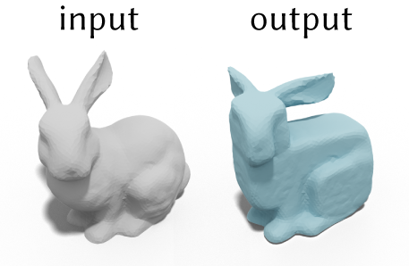

# Cubic Stylization
Cubic stylization is a 3D stylization tool. Unlike image stylization (2D to 2D) and non-photorealistic rendering (3D to 2D), cubic stylization is a 3D to 3D stylization algorithm which takes a manifold triangle mesh as input and outputs a cubified triangle mesh. 

This is a prototype implementation in MATLAB based on "[Cubic Stylization](https://www.dgp.toronto.edu/projects/cubic-stylization/)" by [Hsueh-Ti Derek Liu](https://www.dgp.toronto.edu/~hsuehtil/) and [Alec Jacobson](https://www.cs.toronto.edu/~jacobson/). 

### Get Started
We can download the implementation by cloning the repository
```
git clone https://github.com/HTDerekLiu/CubicStylization_MATLAB.git
```
Once we download the cubic stylization code, we should also clone the only dependency [gptoolbox](https://github.com/alecjacobson/gptoolbox) to ```/path/to/gptoolbox```. After cloning the gptoolbox, we need to add the path to gptoolbox by running the following commands in MATLAB
```
gp_subdirs = split(genpath('/path/to/gptoolbox/'),':');
addpath(strjoin(gp_subdirs(~contains(gp_subdirs,'.git')),':'));
savepath
```

Now we should be ready to play with cubic stylization! The `main.m` is the demo code of the Algorithm 1 in the [paper](https://arxiv.org/abs/1910.02926). Running it with default parameters will give you the following result



If any questions, please contact Hsueh-Ti Derek Liu (hsuehtil@cs.toronto.edu)

### Bibtex
```
@article{Liu:CubicStyle:2019,
  title = {Cubic Stylization},
  author = {Hsueh-Ti Derek Liu and Alec Jacobson},
  year = {2019},
  journal = {ACM Transactions on Graphics}, 
}
```
