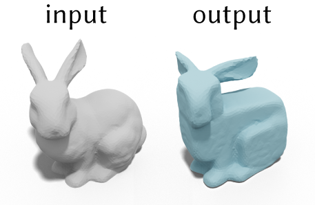

# Spectral Coarsening
This is a simple prototype implementation in MATLAB of the SIGGRAPH Asia 2019 _Cubic Stylization_ [Liu & Jacobson 2019]. The only dependency is the gptoolbox ```https://github.com/alecjacobson/gptoolbox```. After cloning it, it only requires adding the path to gptoolbox by running the following commands in MATLAB
```
gp_subdirs = split(genpath('/path/to/gptoolbox/'),':');
addpath(strjoin(gp_subdirs(~contains(gp_subdirs,'.git')),':'));
savepath
```

The `main_cubicStylization.m` is the demo code of the Algorithm 1 in [Liu & Jacobson 2019]. Running it with default parameters will give you the following result


### bibtex
```
@article{Liu:CubicStyle:2019,
  title = {Cubic Stylization},
  author = {Hsueh-Ti Derek Liu and Alec Jacobson},
  year = {2019},
  journal = {ACM Transactions on Graphics}, 
}
```
